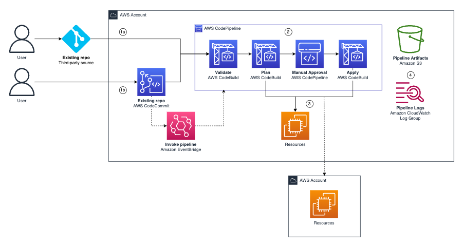

# terraform-aws-pipeline
 
Deploy terraform with terraform. 

🐓 🥚 ?

(If you want to deploy to multiple AWS accounts use [terraform-multi-account-pipeline](https://github.com/aws-samples/terraform-multi-account-pipeline))

## Prerequisites
- An existing AWS CodeCommit repository *OR* an [AWS CodeConnection connection](https://docs.aws.amazon.com/dtconsole/latest/userguide/welcome-connections.html) to the third-party source and repo of your choice (GitHub, Gitlab, etc)
- [Remote state](https://developer.hashicorp.com/terraform/language/state/remote) that the pipeline can access (using the CodeBuild IAM role)  

## Deployment

This module must be deployed to a separate repository to the code you want to push through it.

```
your repo
   modules
   backend.tf 
   main.tf
   provider.tf
   variables.tf    

pipeline repo 
   main.tf <--module deployed here
```

Segregation enables the pipeline to run commands against the code in "your repo" without affecting the pipeline infrastructure. This could be an infrastructure or bootstrap repo for the AWS account.

## Module Inputs

AWS Codecommit:
```hcl
module "pipeline" {
  source        = "aws-samples/pipeline/aws"
  version       = "2.2.3"
  pipeline_name = "pipeline-name"
  repo          = "codecommit-repo-name"
}
```
Third-party service:
```hcl
module "pipeline" {
  source        = "aws-samples/pipeline/aws"
  version       = "2.2.3"
  pipeline_name = "pipeline-name"
  repo          = "organization/repo"
  connection    = aws_codestarconnections_connection.this.arn
}
```
`pipeline_name` is used to name the pipeline and prefix other resources created, like IAM roles. 

`repo` is the name of your existing repo that the pipeline will use as a source. If you are using a third-party service, the format is "my-organization/repo"  

`connection` is the connection arn of the [connection](https://docs.aws.amazon.com/dtconsole/latest/userguide/welcome-connections.html) to the third-party repo. 

### Optional Inputs

```hcl
module "pipeline" {
  ...
  branch                = "main"
  mode                  = "SUPERSEDED"
  detect_changes        = false
  kms_key               = aws_kms_key.this.arn
  access_logging_bucket = aws_s3_bucket.this.id
  artifact_retention    = 90
  log_retention         = 90

  codebuild_policy  = aws_iam_policy.this.arn
  build_timeout     = 10
  terraform_version = "1.5.7"
  checkov_version   = "3.2.0"
  tflint_version    = "0.48.0"
  
  tags = join(",", [
    "Environment[Dev,Prod]",
    "Source"
  ])
  tagnag_version = "0.5.8"

  checkov_skip = [
    "CKV_AWS_144", #Ensure that S3 bucket has cross-region replication enabled
  ]
}
```
`branch` is the branch to source. It defaults to `main`.

`mode` is [pipeline execution mode](https://docs.aws.amazon.com/codepipeline/latest/userguide/concepts-how-it-works.html#concepts-how-it-works-executions). It defaults to `SUPERSEDED`.

`detect_changes` is used with third-party services, like GitHub. It enables AWS CodeConnections to invoke the pipeline when there is a commit to the repo. It defaults to `false`.

`kms_key` is the arn of an *existing* AWS KMS key. This input will encrypt the Amazon S3 bucket with a AWS KMS key of your choice. Otherwise the bucket will be encrypted using SSE-S3. Your AWS KMS key policy will need to allow codebuild and codepipeline to `kms:GenerateDataKey*` and `kms:Decrypt`.

`access_logging_bucket` S3 server access logs bucket ARN, enables server access logging on the S3 artifact bucket.

`artifact_retention` controls the S3 artifact bucket retention period. It defaults to 90 (days). 

`log_retention` controls the CloudWatch log group retention period. It defaults to 90 (days). 

`codebuild_policy` replaces the [AWSAdministratorAccess](https://docs.aws.amazon.com/aws-managed-policy/latest/reference/AdministratorAccess.html) IAM policy. This can be used if you want to scope the permissions of the pipeline. 

`build_timeout` is the CodeBuild project build timeout. It defaults to 10 (minutes). 

`terraform_version` controls the terraform version. It defaults to 1.5.7.

`checkov_version` controls the [Checkov](https://www.checkov.io/) version. It defaults to latest.

`tflint_version` controls the [tflint](https://github.com/terraform-linters/tflint) version. It defaults to 0.48.0.

`tags` enables tag validation with [tag-nag](https://github.com/jakebark/tag-nag). Input a list of tag keys and/or tag keys and values to enforce. Input must be passed as a string, see [commands](https://github.com/jakebark/tag-nag?tab=readme-ov-file#commands). 

`tagnag_version` controls the [tag-nag](https://github.com/jakebark/tag-nag) version. It defaults to 0.5.8.

`checkov_skip` defines [Checkov](https://www.checkov.io/) skips for the pipeline. This is useful for organization-wide policies, removing the need to add individual resource skips. 


## Architecture



1. User commits to existing repository. 
2. The commit invokes an Amazon EventBridge rule, which runs the AWS CodePipeline pipeline.
3. The pipeline validates the code, then runs a `terraform plan`, before waiting for manual approval. Once this is issued, the resources are built with a `terraform apply` (either within the same account or another AWS account, depending on how your code is configured).  
4. Pipeline artifacts are sent to an Amazon S3 bucket. Pipeline activity is logged in Amazon CloudWatch logs. 

#### Pipeline Validation

| Check | Description |
|---|---|
| validate | runs `terraform validate` to make sure that the code is syntactically valid. |
| lint | runs [tfLint](https://github.com/terraform-linters/tflint) which will find errors, depreciated syntax, and check naming conventions. |
| fmt | runs `terraform fmt --recursive --check` to ensure code is consistently formatted. |
| sast | runs [checkov](https://www.checkov.io/) for security best practices. |
| tags (optional)| runs [tag-nag](https://github.com/jakebark/tag-nag) to validate tags.|

## Setup a cross-account pipeline
The pipeline can assume a cross-account role and deploy to another AWS account.

1. Ensure there is a [cross-account IAM role](https://docs.aws.amazon.com/IAM/latest/UserGuide/tutorial_cross-account-with-roles.html) that can be assumed by the codebuild roles (validate and execute). 
2. Edit the provider in "your repo" to include the [assume role argument](https://developer.hashicorp.com/terraform/tutorials/aws/aws-assumerole).

```hcl
provider "aws" {
  region = "eu-west-2"
  assume_role {
    role_arn     = "arn:aws:iam::112233445566:role/cross-account-role"
    session_name = "pipeline"
  }
}
```
3. Commit the changes and run the pipeline.

## Troubleshooting

| Issue | Fix |
|---|---|
| Failed lint or validate | Read the report or logs to discover why the code has failed, then make a new commit. |
| Failed fmt | This means your code is not formatted. Run `terraform fmt --recursive` on your code, then make a new commit. |
| Failed SAST | Read the Checkov logs (click CodeBuild Project > Reports tab) and either make the correction in code or add a skip to the module inputs. |
| Failed plan or apply stage | Read the report or logs to discover error in terraform code, then make a new commit. |
| Pipeline fails on apply with `the action failed because no branch named main was found ...` | Either nothing has been committed to the repo or the branch is incorrect (Eg using `Master` not `Main`). Either commit to the Main branch or change the module input to fix this. |

## Best Practices

The CodeBuild execution role uses the [AWSAdministratorAccess](https://docs.aws.amazon.com/aws-managed-policy/latest/reference/AdministratorAccess.html) IAM policy  as this pattern is designed for a wide audience to deploy any resource to an AWS account. It assumes there are strong organizational controls in place and good segregation practices at the AWS account level. If you need to better scope the policy, the `codebuild_policy` optional input can be used to replace this with an IAM policy of your choosing. 

Permissions to your CodeCommit repository, CodeBuild projects, and CodePipeline pipeline should be tightly controlled. Here are some ideas:
- [Specify approval permission for specific pipelines and approval actions](https://docs.aws.amazon.com/codepipeline/latest/userguide/approvals-iam-permissions.html#approvals-iam-permissions-limited).
- [Using identity-based policies for AWS CodeBuild](https://docs.aws.amazon.com/codebuild/latest/userguide/auth-and-access-control-iam-identity-based-access-control.html). 
- [Limit pushes and merges to branches in AWS CodeCommit](https://docs.aws.amazon.com/codecommit/latest/userguide/how-to-conditional-branch.html)

Checkov skips can be used where Checkov policies conflict with your organization's practices or design decisions. The `checkov_skip` module input allows you to set skips for all resources in your repository. For example, if your organization operates in a single region you may want to add `CKV_AWS_144` (Ensure that S3 bucket has cross-region replication enabled). For individual resource skips, you can still use [inline code comments](https://www.checkov.io/2.Basics/Suppressing%20and%20Skipping%20Policies.html).

## Related Resources

- [terraform-multi-account-pipeline](https://github.com/aws-samples/terraform-multi-account-pipeline)
- [Terraform Registry: aws-samples/pipeline/aws](https://registry.terraform.io/modules/aws-samples/pipeline/aws/latest)

## Security

See [CONTRIBUTING](CONTRIBUTING.md#security-issue-notifications) for more information.

## License

This library is licensed under the MIT-0 License. See the LICENSE file.

<!-- BEGIN_TF_DOCS -->
## Requirements

No requirements.

## Providers

| Name | Version |
|------|---------|
| <a name="provider_aws"></a> [aws](#provider\_aws) | n/a |

## Modules

| Name | Source | Version |
|------|--------|---------|
| <a name="module_apply"></a> [apply](#module\_apply) | ./modules/codebuild | n/a |
| <a name="module_notifications"></a> [notifications](#module\_notifications) | ./modules/notifications | n/a |
| <a name="module_plan"></a> [plan](#module\_plan) | ./modules/codebuild | n/a |
| <a name="module_validation"></a> [validation](#module\_validation) | ./modules/codebuild | n/a |

## Resources

| Name | Type |
|------|------|
| [aws_cloudwatch_event_rule.this](https://registry.terraform.io/providers/hashicorp/aws/latest/docs/resources/cloudwatch_event_rule) | resource |
| [aws_cloudwatch_event_target.this](https://registry.terraform.io/providers/hashicorp/aws/latest/docs/resources/cloudwatch_event_target) | resource |
| [aws_cloudwatch_log_group.this](https://registry.terraform.io/providers/hashicorp/aws/latest/docs/resources/cloudwatch_log_group) | resource |
| [aws_codebuild_report_group.lint](https://registry.terraform.io/providers/hashicorp/aws/latest/docs/resources/codebuild_report_group) | resource |
| [aws_codebuild_report_group.sast](https://registry.terraform.io/providers/hashicorp/aws/latest/docs/resources/codebuild_report_group) | resource |
| [aws_codepipeline.this](https://registry.terraform.io/providers/hashicorp/aws/latest/docs/resources/codepipeline) | resource |
| [aws_iam_policy.codebuild_validate](https://registry.terraform.io/providers/hashicorp/aws/latest/docs/resources/iam_policy) | resource |
| [aws_iam_policy.codepipeline](https://registry.terraform.io/providers/hashicorp/aws/latest/docs/resources/iam_policy) | resource |
| [aws_iam_policy.eventbridge](https://registry.terraform.io/providers/hashicorp/aws/latest/docs/resources/iam_policy) | resource |
| [aws_iam_role.codebuild_execution](https://registry.terraform.io/providers/hashicorp/aws/latest/docs/resources/iam_role) | resource |
| [aws_iam_role.codebuild_validate](https://registry.terraform.io/providers/hashicorp/aws/latest/docs/resources/iam_role) | resource |
| [aws_iam_role.codepipeline_role](https://registry.terraform.io/providers/hashicorp/aws/latest/docs/resources/iam_role) | resource |
| [aws_iam_role.eventbridge](https://registry.terraform.io/providers/hashicorp/aws/latest/docs/resources/iam_role) | resource |
| [aws_iam_role_policy_attachment.codebuild_execution](https://registry.terraform.io/providers/hashicorp/aws/latest/docs/resources/iam_role_policy_attachment) | resource |
| [aws_iam_role_policy_attachment.codebuild_validate](https://registry.terraform.io/providers/hashicorp/aws/latest/docs/resources/iam_role_policy_attachment) | resource |
| [aws_iam_role_policy_attachment.codepipeline](https://registry.terraform.io/providers/hashicorp/aws/latest/docs/resources/iam_role_policy_attachment) | resource |
| [aws_iam_role_policy_attachment.eventbridge](https://registry.terraform.io/providers/hashicorp/aws/latest/docs/resources/iam_role_policy_attachment) | resource |
| [aws_s3_bucket.this](https://registry.terraform.io/providers/hashicorp/aws/latest/docs/resources/s3_bucket) | resource |
| [aws_s3_bucket_lifecycle_configuration.this](https://registry.terraform.io/providers/hashicorp/aws/latest/docs/resources/s3_bucket_lifecycle_configuration) | resource |
| [aws_s3_bucket_logging.this](https://registry.terraform.io/providers/hashicorp/aws/latest/docs/resources/s3_bucket_logging) | resource |
| [aws_s3_bucket_policy.this](https://registry.terraform.io/providers/hashicorp/aws/latest/docs/resources/s3_bucket_policy) | resource |
| [aws_s3_bucket_public_access_block.this](https://registry.terraform.io/providers/hashicorp/aws/latest/docs/resources/s3_bucket_public_access_block) | resource |
| [aws_s3_bucket_server_side_encryption_configuration.this](https://registry.terraform.io/providers/hashicorp/aws/latest/docs/resources/s3_bucket_server_side_encryption_configuration) | resource |
| [aws_caller_identity.current](https://registry.terraform.io/providers/hashicorp/aws/latest/docs/data-sources/caller_identity) | data source |
| [aws_iam_policy_document.codebuild](https://registry.terraform.io/providers/hashicorp/aws/latest/docs/data-sources/iam_policy_document) | data source |
| [aws_iam_policy_document.codebuild_execution_assume](https://registry.terraform.io/providers/hashicorp/aws/latest/docs/data-sources/iam_policy_document) | data source |
| [aws_iam_policy_document.codebuild_validate_assume](https://registry.terraform.io/providers/hashicorp/aws/latest/docs/data-sources/iam_policy_document) | data source |
| [aws_iam_policy_document.codepipeline](https://registry.terraform.io/providers/hashicorp/aws/latest/docs/data-sources/iam_policy_document) | data source |
| [aws_iam_policy_document.codepipeline-assume-role](https://registry.terraform.io/providers/hashicorp/aws/latest/docs/data-sources/iam_policy_document) | data source |
| [aws_iam_policy_document.eventbridge](https://registry.terraform.io/providers/hashicorp/aws/latest/docs/data-sources/iam_policy_document) | data source |
| [aws_iam_policy_document.eventbridge_assume](https://registry.terraform.io/providers/hashicorp/aws/latest/docs/data-sources/iam_policy_document) | data source |
| [aws_iam_policy_document.this](https://registry.terraform.io/providers/hashicorp/aws/latest/docs/data-sources/iam_policy_document) | data source |
| [aws_kms_key.s3](https://registry.terraform.io/providers/hashicorp/aws/latest/docs/data-sources/kms_key) | data source |
| [aws_region.current](https://registry.terraform.io/providers/hashicorp/aws/latest/docs/data-sources/region) | data source |

## Inputs

| Name | Description | Type | Default | Required |
|------|-------------|------|---------|:--------:|
| <a name="input_access_logging_bucket"></a> [access\_logging\_bucket](#input\_access\_logging\_bucket) | s3 server access logging bucket arn | `string` | `null` | no |
| <a name="input_apply_spec"></a> [apply\_spec](#input\_apply\_spec) | apply spec file | `string` | n/a | yes |
| <a name="input_artifact_retention"></a> [artifact\_retention](#input\_artifact\_retention) | s3 artifact bucket retention, in days | `number` | `90` | no |
| <a name="input_assume_role_arn"></a> [assume\_role\_arn](#input\_assume\_role\_arn) | IAM role ARN to assume for CodeBuild | `string` | n/a | yes |
| <a name="input_branch"></a> [branch](#input\_branch) | branch to source | `string` | `"main"` | no |
| <a name="input_build_timeout"></a> [build\_timeout](#input\_build\_timeout) | CodeBuild project build timeout | `number` | `10` | no |
| <a name="input_checkov_skip"></a> [checkov\_skip](#input\_checkov\_skip) | list of checkov checks to skip | `list(string)` | <pre>[<br>  ""<br>]</pre> | no |
| <a name="input_checkov_version"></a> [checkov\_version](#input\_checkov\_version) | n/a | `string` | `"3.2.0"` | no |
| <a name="input_codebuild_event_ids"></a> [codebuild\_event\_ids](#input\_codebuild\_event\_ids) | n/a | `list(string)` | <pre>[<br>  "codebuild-project-build-state-failed",<br>  "codebuild-project-build-state-succeeded"<br>]</pre> | no |
| <a name="input_codebuild_policy"></a> [codebuild\_policy](#input\_codebuild\_policy) | replaces CodeBuild's AWSAdministratorAccess IAM policy | `string` | `null` | no |
| <a name="input_codepipeline_event_ids"></a> [codepipeline\_event\_ids](#input\_codepipeline\_event\_ids) | n/a | `list(string)` | <pre>[<br>  "codepipeline-pipeline-pipeline-execution-failed",<br>  "codepipeline-pipeline-pipeline-execution-canceled",<br>  "codepipeline-pipeline-pipeline-execution-started",<br>  "codepipeline-pipeline-pipeline-execution-resumed",<br>  "codepipeline-pipeline-pipeline-execution-succeeded",<br>  "codepipeline-pipeline-stage-execution-resumed",<br>  "codepipeline-pipeline-stage-execution-failed",<br>  "codepipeline-pipeline-stage-execution-canceled",<br>  "codepipeline-pipeline-manual-approval-needed"<br>]</pre> | no |
| <a name="input_connection"></a> [connection](#input\_connection) | arn of the CodeConnection | `string` | `null` | no |
| <a name="input_detect_changes"></a> [detect\_changes](#input\_detect\_changes) | allows third-party servicesm like GitHub to invoke the pipeline | `bool` | `false` | no |
| <a name="input_enable_notifications"></a> [enable\_notifications](#input\_enable\_notifications) | Enable notifications for the pipeline | `bool` | `true` | no |
| <a name="input_env_vars"></a> [env\_vars](#input\_env\_vars) | Extra environment variables to be passed to CodeBuild | `map(string)` | `{}` | no |
| <a name="input_github_key"></a> [github\_key](#input\_github\_key) | GitHub private key to access interal repositories | `string` | `""` | no |
| <a name="input_kms_key"></a> [kms\_key](#input\_kms\_key) | AWS KMS key ARN | `string` | `null` | no |
| <a name="input_log_retention"></a> [log\_retention](#input\_log\_retention) | CloudWatch log group retention, in days | `number` | `90` | no |
| <a name="input_manual_approve"></a> [manual\_approve](#input\_manual\_approve) | Determines whether to add a manual approval step before the apply stage. | `bool` | `true` | no |
| <a name="input_mode"></a> [mode](#input\_mode) | pipeline execution mode | `string` | `"SUPERSEDED"` | no |
| <a name="input_pipeline_name"></a> [pipeline\_name](#input\_pipeline\_name) | n/a | `string` | n/a | yes |
| <a name="input_plan_spec"></a> [plan\_spec](#input\_plan\_spec) | plan spec file | `string` | n/a | yes |
| <a name="input_repo"></a> [repo](#input\_repo) | source repo name | `string` | n/a | yes |
| <a name="input_source_dir"></a> [source\_dir](#input\_source\_dir) | CodeBuild source directory | `string` | `"."` | no |
| <a name="input_tagnag_version"></a> [tagnag\_version](#input\_tagnag\_version) | n/a | `string` | `"0.5.8"` | no |
| <a name="input_tags"></a> [tags](#input\_tags) | tags to check for | `string` | `""` | no |
| <a name="input_terraform_version"></a> [terraform\_version](#input\_terraform\_version) | n/a | `string` | `"1.5.7"` | no |
| <a name="input_tflint_version"></a> [tflint\_version](#input\_tflint\_version) | n/a | `string` | `"0.48.0"` | no |
| <a name="input_validation_lint_settings"></a> [validation\_lint\_settings](#input\_validation\_lint\_settings) | Settings for the lint validation stage. Valid values for on\_failure are the same as the codebuild on-failure settings. | <pre>object({<br>    enabled             = optional(bool, true)<br>    continue_on_failure = optional(bool, true)<br>  })</pre> | <pre>{<br>  "continue_on_failure": true,<br>  "enabled": true<br>}</pre> | no |
| <a name="input_validation_sast_settings"></a> [validation\_sast\_settings](#input\_validation\_sast\_settings) | Settings for sast validation stage. Valid values for on\_failure are the same as the codebuild on-failure settings. | <pre>object({<br>    enabled             = optional(bool, true)<br>    continue_on_failure = optional(bool, true)<br>  })</pre> | <pre>{<br>  "enabled": true,<br>  "on_failure": true<br>}</pre> | no |

## Outputs

| Name | Description |
|------|-------------|
| <a name="output_notification_sns_topic_arn"></a> [notification\_sns\_topic\_arn](#output\_notification\_sns\_topic\_arn) | SNS topic ARN for notifications |
<!-- END_TF_DOCS -->